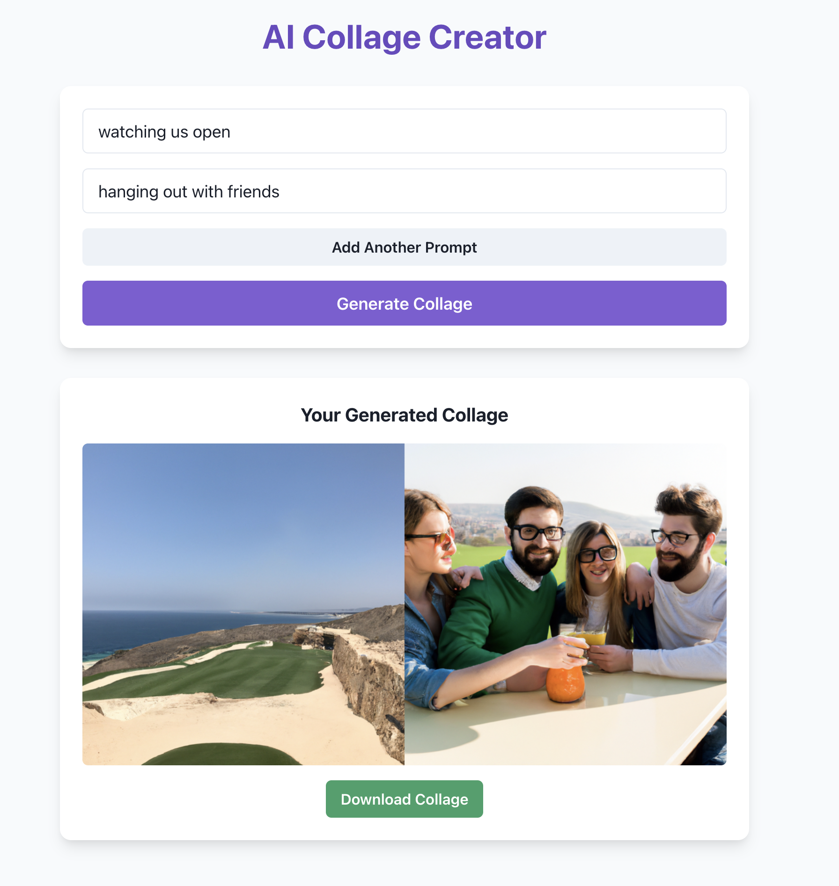

# AI Mood Collage Generator

This project is the final project of Group 7 of the AI and GPT Bootcamp hosted by Encode Club. The AI Mood Collage Generator is a web application that allows users to create a collage based on multiple prompts representing their mood. The application uses OpenAI's DALL-E model to generate images and the Sharp library to create a collage from these images.

## Features

- **Generate Collage**: Create a collage based on multiple text prompts.
- **Download Collage**: Download the generated collage as a PNG file.
- **Responsive UI**: Built with React and Chakra UI for a modern and responsive user interface.

## Technologies Used

- **Backend**: Node.js, Express, Axios, Sharp
- **Frontend**: React, Chakra UI
- **AI Model**: OpenAI's DALL-E for image generation

## Demo



## Installation

1. Clone the repository:

   ```bash
   git clone https://github.com/yourusername/ai-mood-collage-generator.git
   cd ai-mood-collage-generator
   ```

2. Set up environment variables:

   - Provide your OpenAI API key in a `.env` file in the backend directory.

3. Install dependencies and start the backend server:

   ```bash
   cd backend
   npm install
   npm start
   ```

4. Install dependencies and start the frontend server:

   ```bash
   cd ../frontend
   npm install
   npm run dev
   ```

5. Open [http://localhost:5173](http://localhost:5173) in your browser to use the application.

## Folder Structure

```
ai-powered-mood-board/
├── backend/
│   ├── src/
│   │   └── index.jsx
│   ├── .env
│   ├── package.json
│   └── .gitignore
├── frontend/
│   ├── src/
│   │   ├── App.jsx
│   │   ├── main.jsx
│   │   └── index.css
│   ├── public/
│   ├── package.json
│   ├── .gitignore
│   └── tailwind.config.js
└── README.md
```

## How It Works

1. **User Input**: Users enter multiple text prompts that describe their mood.
2. **Image Generation**: The backend uses OpenAI's DALL-E model to generate images based on the prompts.
3. **Collage Creation**: The Sharp library is used to create a collage from the generated images.
4. **Download**: Users can download the collage as a PNG file.

## Contributing

1. Fork the repository.
2. Create your feature branch (`git checkout -b feature/amazing-feature`).
3. Commit your changes (`git commit -m 'Add some amazing feature'`).
4. Push to the branch (`git push origin feature/amazing-feature`).
5. Open a Pull Request.

## License

This project is licensed under the MIT License - see the [LICENSE](LICENSE) file for details.

## Acknowledgments

- [OpenAI](https://openai.com/) for providing the DALL-E API.
- [Chakra UI](https://chakra-ui.com/) for the UI components.
- [Sharp](https://sharp.pixelplumbing.com/) for image processing.
